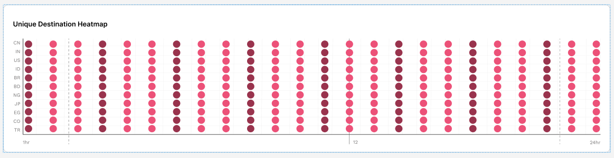
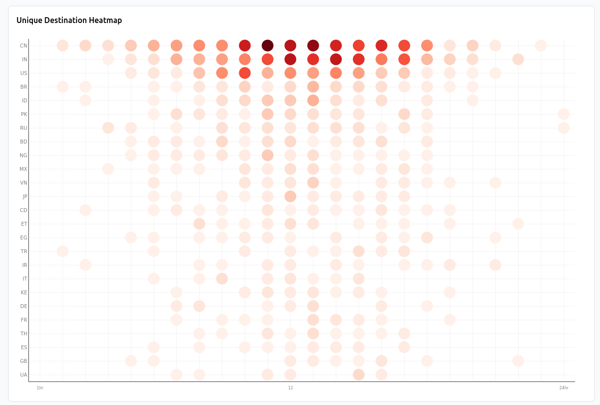

<details>
  <summary>Take-Home Project Requirement</summary>

# Take-Home Project Requirement

## Objective

Enhance the provided starter project by implementing an interactive heatmap graph to display the number of unique visitors by country and hour of the day, with a selectable date range.

## Provided Resources

- **Starter Project**: Pre-configured with SvelteKit, tRPC, TypeScript, and TailwindCSS, adhering to our coding standards.
  - Includes sample code that greets the user by name.(can be removed)
  - ElasticSearch client setup is included.
- **Figma Design**: [Figma Design Link](https://www.figma.com/design/ryzsNfjmzOqVFWlFEcfKgq/Untitled?node-id=0-1&t=rzAYJm61YZciE01b-1)
The design except the Graph is just a mock up you can improve it however you want
- **Kibana Dashboard**: [Kibana Dashboard Link](https://bilby-terminal-test.kb.us-central1.gcp.cloud.es.io:9243/app/dashboards#/view/edf84fe0-e1a0-11e7-b6d5-4dc382ef7f5b)
  - **Credential**: [Login information](https://share.1password.com/s#vKJUpv0VsOnwUeO4zHN3p8utQC4jV4lA7wyQ0TWUWxE)
  - **Graph**: Search for the heatmap graph titled "[Logs] Unique Destination Heatmap" in Kibana for reference.

## Task Description

1. **Clone and Fork the Starter Project**:
   - Fork the repository to your GitHub account.
   - Clone the provided repository to your local development environment.
   - **Running the Project**:
     - After cloning or forking the project, navigate to the project directory.
     - Install dependencies with `npm install` (or `pnpm install` or `yarn`).
     - Rename `.env.example` to `.env` and add the env information from this [link](https://share.1password.com/s#S2aCrzRYgtW1PfFUXBGYSMqT_af1lFe4r8mujK0eRSw)
     - Start a development server:

       ```bash
       npm run dev

       # or start the server and open the app in a new browser tab
       npm run dev -- --open
       ```

2. **Implement the Heatmap Graph**:
   - **Frontend**:
     - Use **SvelteKit** to create the interactive heatmap UI.
     - Style the heatmap according to the provided Figma design
     - Utilize a suitable visualization library such as **D3.js** or any other library appropriate for creating heatmaps.
     - The heatmap should have:
       - **Y-axis**: List of countries.
       - **X-axis**: Hours of the day (1-24).
       - **Cells**: Represent the number of unique visitors, with varying colors indicating different visitor counts.
     - (Optional) Implement interactivity features such as tooltips displaying detailed information when hovering over a cell.
     - **Date Range Selector**:
       - Add a select dropdown to filter data by predefined date ranges:
         - Last week
         - Last two weeks
         - Last month
         - Last quarter
         - Last year
       - Ensure the heatmap updates dynamically when the date range is changed.

   - **Backend**:
     - Use **tRPC** to create API endpoints for fetching data from ElasticSearch.
     - Write endpoints to:
       - Fetch and aggregate unique visitor data by country and hour.
       - Filter data based on the selected date range.
       - Handle the predefined date ranges to fetch appropriate data from ElasticSearch.
     - Connect to the ElasticSearch instance using the provided Kibana credentials.

   - **Data Handling**:
     - Ensure the ElasticSearch queries are efficient and optimized for aggregation.
     - Aggregate data to count unique visitors by country and hour.

## Evaluation Criteria

- **Code Quality**: Clean, readable, and maintainable code following best practices.
- **Functionality**: Correct implementation of the heatmap and date range selector as per the provided Figma design.
- **Interactivity**: Smooth and intuitive user interactions.
- **Efficiency**: Optimal data fetching and processing from ElasticSearch.
- **Documentation**: Clear and detailed documentation and README updates.

#### Submission

- **Submission form**: [Form Link](https://forms.gle/E13oWiJk6nB3HTnz5)
- **Repository**: Submit the link to your forked repository in the above google form
</details>


# Implemented Features

The following sections describe the main aspects of the features implemented on the project, and some details regarding its development and behavior. All the required features were implemented, and some additional features were added to improve the user experience.

## Frontend

The application was implemented using SvelteKit, and no component library was needed on the project. It was implemented with responsiveness in mind, to adapt to small screens. The styles were added using TailwindCSS.

### Heatmap

It was used to implement the heatmap the recommended library D3.js, implementing a heatmap graph from scratch over an SVG element. The graph was styled following the design provided and all its details: axis, labels, cells and background grid.

Heatmap Design Reference

Heatmap Implemented


The heatmap is responsive and adapts to the available space of the viewport. Horizontally it uses as much space as possible but if the hours don't fit on the width of the screen, it uses 35px * 24 hours of width (cells radius is 15px), to nicely fit all the hours and add an horizontal scrollbar if needed.

Similarly, the heatmap grows vertically to fit the amount of countries received.

### Tooltip

A tooltip was implemented that shows the amount of visitors for the hovered cell. The tooltip works on desktop and mobile view as well.

On desktop, it is displayed when the mouse enters a cell and hides when it leaves it. For mobile view, the tooltip is displayed when the user taps on a cell, and hided when taps outside.

The cells on the heatmap are navigable using the keyboard, and when a cell is focused, the tooltip is displayed. On Esc key press, the tooltip is hidden.

### Select Dropdown

The select dropdown emits data changes events to the parent component. The parent component then fetches the data from the backend and updates the heatmap with the new data.

Internally the heatmap is rebuilt using the new data points. This steps requires to remove the previous heatmap to avoid overlap the new data over the previous one and to free memory used by the vectors of the previous heatmap.

## Backend

### TRPC

A single endpoint was created to satisfy the functionality required by the UI. This endpoint receives a time period (`last_week`, `last_two_weeks`, `last_month`, `last_quarter` or `last_year`) and returns the data points corresponding to that period. Each period maps to its specific time range bounds according it its meaning, those bounds are used to filter out values from the query to Elastic Search.

### Elastic Search

By default is returned information for 25 countries, each country has an array of hours that has the visits for each hour of the day (0 - 23). The visits are counted as unique for the hour and country using the client IP of the visitor.
